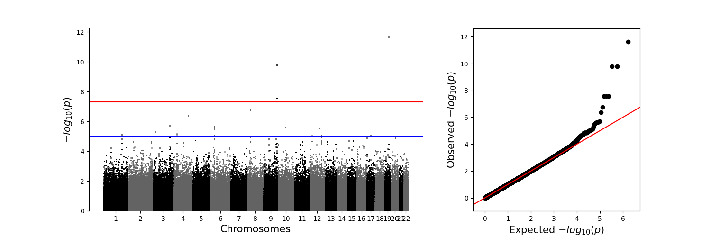

# GAM (GWAS with Advanced Machine-learning)
_If you didn't want who I GWAS, you don't deserve who I **GAM**..._

This is Pei Ting Chua Chai and Omar Halawa's CSE185 project. It implements a subset of the the "--linear" GWAS method available through plink. See the [plink --linear](https://www.cog-genomics.org/plink/1.9/assoc#linear) page for more details.

# Install instructions

Installation requires the [`pandas`](https://pandas.pydata.org/), [`numpy`](https://numpy.org/), [`cyvcf2`](https://brentp.github.io/cyvcf2/), [`scipy`](https://docs.scipy.org/doc/scipy/), [`sklearn`](https://scikit-learn.org/), [`matplotlib`](https://matplotlib.org/), [`qqman`](https://pypi.org/project/qqman/), [`statsmodels`](https://www.statsmodels.org/stable/index.html), [`art`](https://pypi.org/project/art/) libraries to be installed. You can install these with [`pip install`](https://www.dataquest.io/blog/install-pip-windows/) or [`conda install`](https://dev.to/waylonwalker/installing-miniconda-on-linux-from-the-command-line-4ad7):

```
pip install pandas==1.5.0 numpy==1.23.3 qqman==1.0.6 scipy==1.9.3 statsmodels==0.14.0 matplotlib==3.7.1 art==5.9 scikit-learn==1.2.2 cyvcf2==0.30.22
```

_**Important Note:**_ If the above command fails in any way, try the following two commands below which install everything via pip except for `cyvcf2` which is installed via conda.
```
pip install pandas==1.5.0 numpy==1.23.3 qqman==1.0.6 scipy==1.9.3 statsmodels==0.14.0 matplotlib==3.7.1 art==5.9 scikit-learn==1.2.2 
conda install -c bioconda cyvcf2
```

Once required libraries are installed, you can install `gam` with the following command:

```
git clone https://github.com/omarhalawa3301/gam.git
cd gam
python setup.py install --user
```

If the install was successful, typing `gam --help` should show a useful message.

If you get an error saying the command was not found, then run the following (with substituting the appropriate user directory):
```
export PATH=$PATH:/home/<user>/.local/bin
```

# Basic usage

The basic usage of `gam` is (uses the `--linear` option, one of the 3 available modes - see **gam options**):

```
gam -l -g genotype.vcf.gz -p phenotype.phen
```

To run `gam` on a **small** test example (using files in this repo) (this run should not take more than 1 second):
```
gam -l -g example-files/test.vcf.gz -p example-files/test.phen --covar example-files/lab3_gwas.eigenvec --maf 0.05
```
You should then be the output assoc.linear results file and plot png file under the _example-files_ directory (there are references under the _example-files/ref_results_ and _example-files/ref_visuals_ directories)

This **small test** should produce the following Manhattan plot and qqplot below:
  


To run `gam` on a **large** test example with recommended arguments (using files in this repo) (should take ~2 hours for this run as it contains 900,000 SNPs and 207 samples with no multithreading implemented yet):
```
gam -l -g example-files/lab3_gwas.vcf.gz -p example-files/lab3_gwas.phen --dir large_test_run --out large_test --covar example-files/lab3_gwas.eigenvec --maf 0.05
```
Similarly to the small test run, outputs should be under the _example-files_ directory (references also found in sub-directories for cross-checking)

This test should produce the following Manhattan plot and qqplot below:
  


To compare this last run to the output of `plink --linear`, run:
```
plink --linear hide-covar --covar example-files/lab3_gwas.eigenvec --allow-no-sex -g example-files/test2.vcf.gz -p example-files/test.phen --maf 0.05 --out plink_run
```
Outputs are identical for the `gam -l` option run

# gam options

The only required inputs to `gam` are 

1. `-g GENOTYPE_FILE`, `--genotype GENOTYPE_FILE` as a **.vcf.gz** file (more file type implementation to come)
2. `-p PHENOTYPE_FILE`, `--phenotype PHENOTYPE_FILE` as a **.phen** file
3. Either _**one**_ of the three following modes:
* `-l`, `--linear` where GWAS with a normal linear-regression model is done
* TODO: `--le`, `--linear-ensemble` where GWAS is done using an ensemble of linear regression models
* TODO: `--bdt`, `--boosted` where GWAS is done using boosted decision trees to build the model
    


Users may additionally specify the options below:
TODO:
* `-m FLOAT`, `--maf FLOAT`: float representing minor allele frequency. If specified, the script will perform further filtration on the dataset provided by excluding SNPs whose MAF values lie below the assigned threshold. 

* `--covar EIGENVECFILE`: name of .eigenvec file from a PCA run to use in accounting for confounding factors by covariates.

* `-d DIRECTORY`, `--dir DIRECTORY`: path to output result file(s). By default, the path is the current working directory.

* `-o FILE`, `--out file`: basename of result file(s). By default, this is the basename of the genotype file.

# File format

The output file format, **.assoc.linear**, is the same as that of the `plink --linear` method. See [here](https://www.cog-genomics.org/plink/1.9/formats#assoc_linear) for more details.

# Contributors

This repository was generated by Pei Ting Chua Chai and Omar Halawa, with inspiration from the [CSE 185 Demo Project](https://github.com/gymreklab/cse185-demo-project), [GenePattern Random Forest](https://github.com/genepattern/RandomForest), and many other projects.

Please submit a pull request with any corrections or suggestions.


