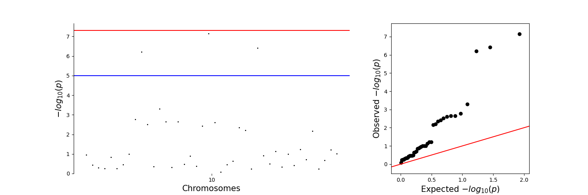
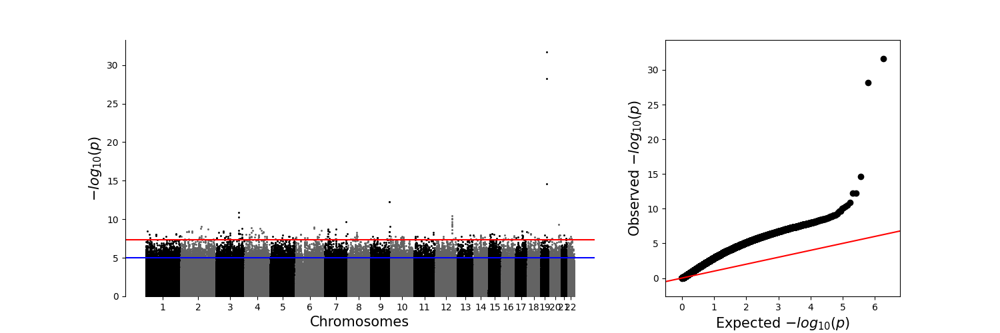

. 　　　。　　　　•　 　ﾟ　　。 　　.

　　　.　　　 　　.　　　　　。　　 。　. 　

.　　 。　　　　　 ඞ 。 . 　　 • 　　　　•

　　ﾟ　　 Red was not An Impostor.　 。　.

　　'　　　 1 Impostor remains 　 　　。

　　ﾟ　　　.　　　. ,　　　　.　 .
  
  Note to reviewer (yes, you!): We are currently still ironing out the kinks of our tool's implementation, so we would really appreciate it if you could do your review later in the week (we are working toward finishing by Thursday at the very latest). We promise you it will not take too long to run if you simply follow the instructions in this README.md, and we will be updating this note with an estimated time of installing the tool and running it on example data so that you can rest assured. Thank you ඞ

  Update to note: installation should be seamless, and running on the **small dataset should take no time at all.** If you wish to run on the much larger, **genome-wide dataset, it should take around 22 minutes** to do all the processing and generate the visuals (which match plink's outputs exactly for the currently-implemented `-l` option) as there is no multithreading implemented yet.


# GAM (GWAS with Advanced Machine-learning)
_If you didn't want who I GWAS, you don't deserve who I **GAM**..._

This is Pei Ting Chua Chai and Omar Halawa's CSE185 project. It implements a subset of the the "--linear" GWAS method available through plink. See the [plink --linear](https://www.cog-genomics.org/plink/1.9/assoc#linear) page for more details.

# Install instructions

Installation requires the [`pandas`](https://pandas.pydata.org/), [`cyvcf2`](https://brentp.github.io/cyvcf2/), [`scipy`](https://docs.scipy.org/doc/scipy/), [`matplotlib`](https://matplotlib.org/), and [`qqman`](https://pypi.org/project/qqman/) libraries to be installed. You can install these with `pip install` or `conda install`:

_**Important Note:**_ You _may_ experience some issues with installing `cyvcf2` via pip due to versioning discrepancies. As a result, it is recommended you install this one package via conda.

```
pip install pandas scipy matplotlib qqman
conda install cyvcf2
```

Once required libraries are installed, you can install `gam` with the following command:

```
python setup.py install --user --prefix=$HOME
```

If the install was successful, typing `gam --help` should show a useful message.

# Basic usage

The basic usage of `gam` is (uses the `--linear` option, one of the 3 available modes - see **gam options**):

```
gam -l -g genotype.vcf.gz -p phenotype.phen
```

To run `gam` on a **small** test example (using files in this repo) (this run should not take more than 1 second):
```
gam -l -g example-files/test.vcf.gz -p example-files/test.phen
```
You should then be the output assoc.linear results file and plot png file under the _example-files_ directory (there are references under the _example-files/ref_results_ and _example-files/ref_visuals_ directories)

This **small test** should produce the following Manhattan plot and qqplot below:
  


To run `gam` on a **large** test example (using files in this repo) (should take ~22 minutes for this run as it contains 900,000 SNPs and 207 samples, no multithreading implemented yet):
```
gam -l -g example-files/lab3_gwas.vcf.gz -p example-files/lab3_gwas.phen
```
Similarly to the small test run, outputs should be under the _example-files_ directory (references also found in sub-directories for cross-checking)

This test should produce the following Manhattan plot and qqplot below:
  


To compare to output of `plink --linear`, run:
```
TODO:
```
Outputs are identical for the `gam -l` option run

# gam options

The only required inputs to `gam` are 

1. `-g GENOTYPE_FILE`, `--genotype GENOTYPE_FILE` as a **.vcf.gz** file (more file type implementation to come)
2. `-p PHENOTYPE_FILE`, `--phenotype PHENOTYPE_FILE` as a **.phen** file
3. Either _**one**_ of the three following modes:
* `-l`, `--linear` where GWAS with a normal linear-regression model is done
* `--le`, `--linear-ensemble` where GWAS is done using an ensemble of linear regression models
* `--bdt`, `--boosted` where GWAS is done using boosted decision trees to build the model
    


Users may additionally specify the options below:
TODO:
<!-- * `-m FLOAT`, `--maf FLOAT`: float representing minor allele frequency. If specified, the script will perform further filtration on the dataset provided by excluding SNPs whose MAF values lie below the assigned threshold. 

* `-o FILE`, `--out FILE`: path to output result file(s). By default, the path is the current working directory. -->


# File format

The output file format, **.assoc.linear**, is the same as that of the `plink --linear` method. See [here](https://www.cog-genomics.org/plink/1.9/formats#assoc_linear) for more details.

# Contributors

This repository was generated by Pei Ting Chua Chai and Omar Halawa, with inspiration from the [CSE 185 Demo Project](https://github.com/gymreklab/cse185-demo-project), [GenePattern Random Forest](https://github.com/genepattern/RandomForest), and many other projects.

Please submit a pull request with any corrections or suggestions.

# Automated Testing (work-in-progress)

To run tests:
```
# Run command line tests
TODO: 
<!-- sh tests/cmdline_tests.sh -->

# Run unit tests
TODO: 
<!-- python -m pytest --cov=. -->
```


